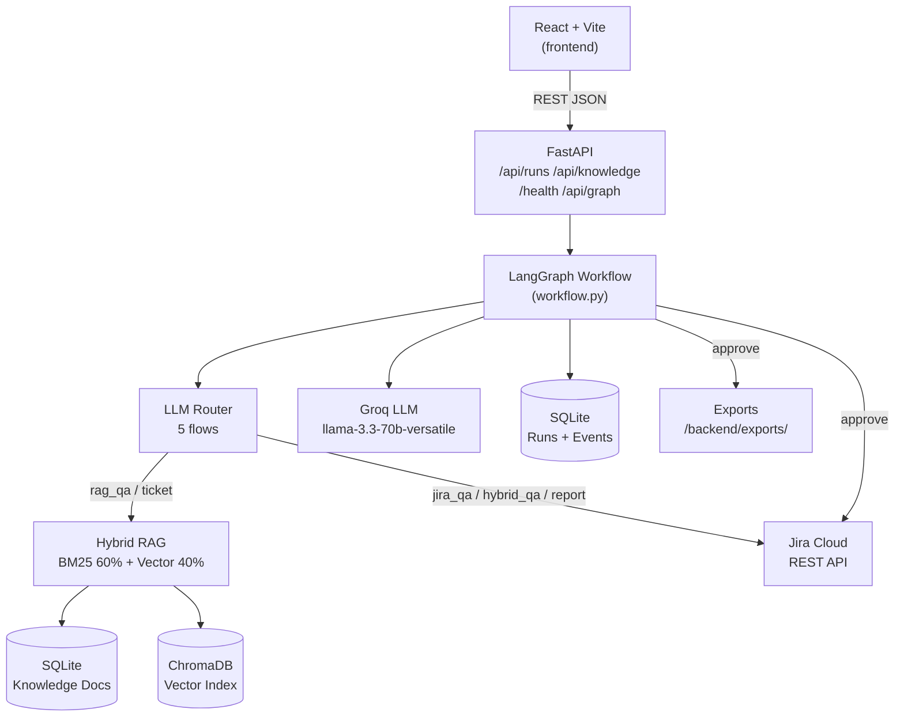
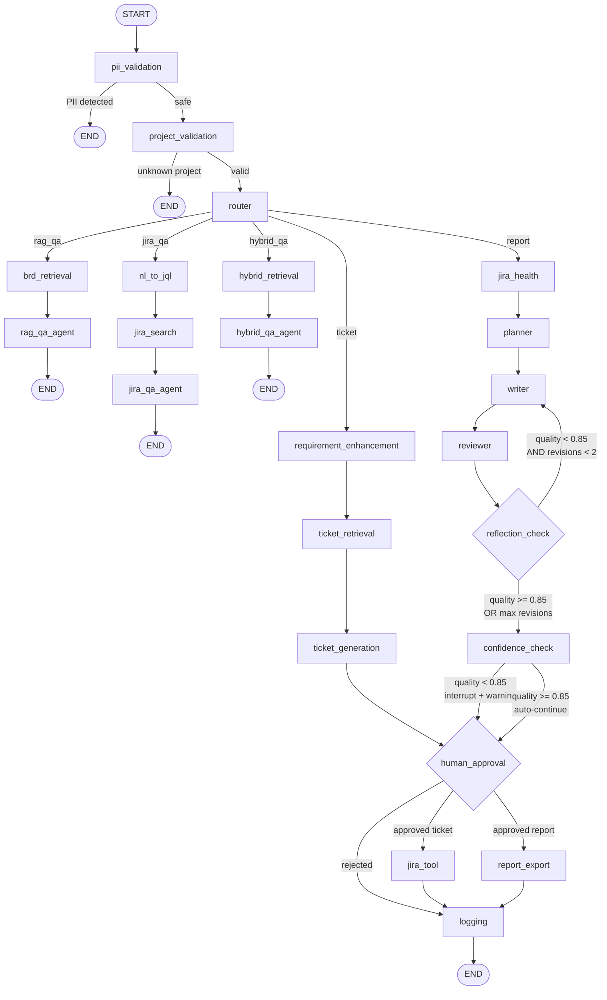
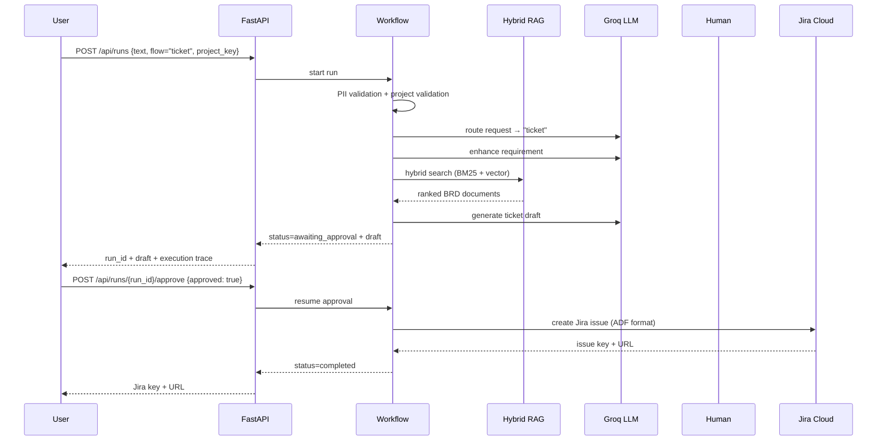
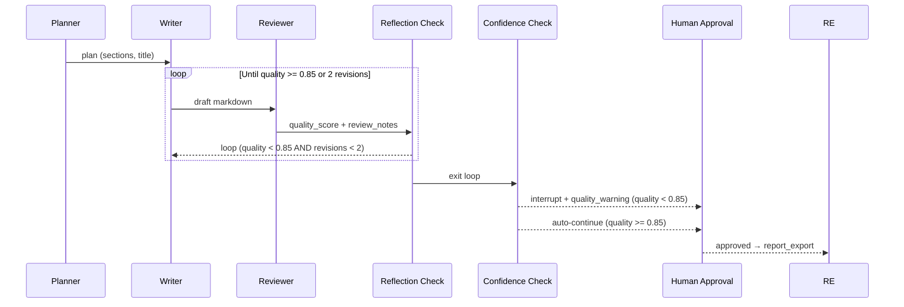

# AI Requirements Assistant

A multi-agent system that turns natural-language requests into approved **Jira tickets** or **project status reports**. Powered by LangGraph, Groq LLMs, and hybrid RAG — with full human-in-the-loop approval and execution observability.

---

## What it does

Five autonomous agent flows, auto-routed from a single chat interface:

| Flow | Trigger | Output |
|------|---------|--------|
| **ticket** | "Create a story for X" | Jira ticket draft → approval → live Jira issue |
| **report** | "Generate a status report for EOMS" | Markdown report → approval → exported file |
| **rag\_qa** | "What does the BRD say about X?" | Grounded answer from BRD knowledge base |
| **jira\_qa** | "How many open bugs are in EOMS?" | Factual answer from live Jira via NL→JQL |
| **hybrid\_qa** | "What's missing vs Jira?" | Gap analysis: BRD requirements vs Jira coverage |

---

## Architecture



---

## Agent Graph — 5-flow topology



---

## Workflow sequence — ticket flow



---

## Reflection loop — report flow



---

## Quick start

### Prerequisites

- Python 3.11+
- Node.js 18+

### Backend

```bash
cd backend
python -m venv .venv
source .venv/bin/activate        # Windows: .venv\Scripts\activate
pip install -r requirements.txt
cp .env.example .env             # add API keys (see table below)
uvicorn app.main:app --reload --port 8000
```

Backend runs at **http://localhost:8000**

### Frontend

```bash
cd frontend
npm install
npm run dev
```

Frontend runs at **http://localhost:5173**

### Tests

```bash
cd backend
source .venv/bin/activate
pytest -q
```

---

## Environment variables

| Variable | Required | Default | Purpose |
|----------|----------|---------|---------|
| `GROQ_API_KEY` | Optional | — | Groq LLM — enables real ticket/report generation |
| `GROQ_MODEL` | Optional | `llama-3.3-70b-versatile` | Groq model ID |
| `JIRA_BASE_URL` | Optional | — | Jira Cloud URL e.g. `https://yourco.atlassian.net` |
| `JIRA_EMAIL` | Optional | — | Atlassian account email |
| `JIRA_API_TOKEN` | Optional | — | Jira API token from Atlassian account settings |
| `JIRA_PROJECT_KEY` | Optional | `DEMO` | Target project key |
| `LANGSMITH_API_KEY` | Optional | — | LangSmith tracing |
| `LANGSMITH_PROJECT` | Optional | — | LangSmith project name |

**Operating modes:**

| Mode | Condition | Behaviour |
|------|-----------|-----------|
| `demo` | No keys | Template responses, mock Jira key `DEMO-101` |
| `groq` | Groq key only | LLM drafts, mock Jira on approval |
| `live` | Groq + Jira keys | LLM drafts + real Jira ticket creation |

---

## API reference

| Endpoint | Method | Description |
|----------|--------|-------------|
| `/health` | GET | Health check + operating mode (`demo`/`groq`/`live`) |
| `/api/chat` | POST | Unified chat: `{ text, project_key, llm_params? }` |
| `/api/runs` | POST | Start a workflow run: `{ text, flow?, project_key? }` |
| `/api/runs/{run_id}` | GET | Run state, draft, timeline events, token counts |
| `/api/runs/{run_id}/approve` | POST | Approve/reject: `{ approved, feedback? }` |
| `/api/knowledge` | GET | List BRD knowledge documents |
| `/api/knowledge` | POST | Add a document: `{ title, content, project_key }` |
| `/api/graph` | GET | LangGraph topology as Mermaid source |

All request/response bodies are Pydantic models in [`backend/app/models.py`](backend/app/models.py).

---

## LLM parameters (via UI or API)

| Parameter | Default | Range | Effect |
|-----------|---------|-------|--------|
| `temperature` | per-task | 0.0 – 1.0 | Higher = more creative output |
| `max_tokens` | per-task budget | 256 – 4096 | Cap on completion length |

Per-task defaults: `extraction`/`review` = 0.1, `planning` = 0.7, `creative`/`writing` = 0.8, `structured` = 0.0

---

## Project structure

```
AI-Agent-JIRA/
├── backend/
│   ├── app/
│   │   ├── agents/          # router, ticket, report, qa agents
│   │   │   ├── router.py    # LLM-based flow classification
│   │   │   ├── ticket.py    # requirement enhancement + ticket generation
│   │   │   ├── report.py    # plan_report, write_report, review_report
│   │   │   └── qa.py        # answer_from_rag, answer_from_jira, answer_hybrid, nl_to_jql
│   │   ├── graph/
│   │   │   ├── builder.py   # LangGraph topology (authoritative node/edge definitions)
│   │   │   └── state.py     # GraphState TypedDict
│   │   ├── tools/
│   │   │   ├── jira.py      # Jira REST (health, search, create ticket — ADF format)
│   │   │   ├── pii.py       # PII detection + redaction
│   │   │   ├── retrieval.py # hybrid_search_tool (BM25 + vector)
│   │   │   ├── export.py    # Markdown report export
│   │   │   └── state.py     # human_feedback helper
│   │   ├── retrievers/
│   │   │   ├── bm25.py      # BM25 keyword retrieval
│   │   │   ├── vector.py    # ChromaDB vector retrieval
│   │   │   └── hybrid.py    # score fusion (60% BM25 + 40% vector)
│   │   ├── services/
│   │   │   ├── llm.py       # invoke_llm / invoke_json (Groq wrapper)
│   │   │   └── tokens.py    # per-task token budgets
│   │   ├── prompts/
│   │   │   ├── templates.py   # report flow prompts
│   │   │   └── qa_templates.py # Q&A flow prompts
│   │   ├── logging/
│   │   │   └── logger.py    # track_node, append_event, log_* helpers
│   │   ├── config.py        # env vars, temperature map, operating mode
│   │   ├── database.py      # SQLite — runs, knowledge, execution log
│   │   ├── models.py        # Pydantic models (RunState, ChatRequest, etc.)
│   │   ├── workflow.py      # execution engine — all 5 flows
│   │   └── main.py          # FastAPI app + routes
│   ├── tests/               # pytest test suite
│   ├── exports/             # approved reports saved here
│   ├── logs/                # agent.log (rotating, DEBUG level)
│   ├── requirements.txt
│   └── Dockerfile
│
├── frontend/
│   └── src/
│       ├── main.jsx         # single-file React app — chat, observability, approval
│       └── style.css        # dark/light theme, timeline, run summary styles
│
└── docs/                    # HLD, LLD, architecture, API, RAG, sequence, prompts, etc.
```

---

## RAG design

Ticket flow retrieves BRD knowledge documents using score fusion:

```
final_score = 0.60 × bm25_score + 0.40 × vector_score
```

Both component scores are preserved on the run for observability. ChromaDB stores sentence-transformer embeddings (`all-MiniLM-L6-v2`). BM25 uses `rank-bm25`. Production path: swap vector proxy for OpenAI/Cohere embeddings + managed vector store, add reranking.

---

## Deployment

### Frontend — Vercel (free Hobby tier)

```bash
cd frontend
npx vercel --prod
# Framework: Vite | Root: frontend/ | Build: npm run build | Output: dist
```

Or via Vercel dashboard: import GitHub repo → set root directory to `frontend/` → deploy.

Set `VITE_API_URL=https://your-backend-url` in Vercel environment variables.

### Backend — Fly.io (included `fly.toml`)

```bash
cd backend
fly launch          # first time
fly deploy          # subsequent deploys
fly secrets set GROQ_API_KEY=... JIRA_BASE_URL=... JIRA_EMAIL=... JIRA_API_TOKEN=...
```

### Backend — Docker

```bash
cd backend
docker build -t ai-agent-jira .
docker run -p 8000:8000 --env-file .env ai-agent-jira
```

### Production checklist

- Replace SQLite with Postgres
- Replace ChromaDB local store with managed vector DB (Pinecone, Weaviate, etc.)
- Enable LangGraph checkpointer for durable approval state
- Protect `/api/` with authentication + rate limiting
- Set CORS to deployed frontend origin only
- Use Jira least-privilege API token (create/read only)
- Enable LangSmith tracing (`LANGSMITH_API_KEY`)

---

## Tech stack

| Layer | Technology |
|-------|-----------|
| Frontend | React 18, Vite, vanilla CSS |
| Backend | FastAPI, Uvicorn, Python 3.11 |
| Orchestration | LangGraph 0.2, LangChain Core |
| LLM | Groq (`llama-3.3-70b-versatile`) |
| RAG | rank-bm25, ChromaDB, sentence-transformers |
| Persistence | SQLite (runs + knowledge), ChromaDB (vectors) |
| Jira | Atlassian REST API v3 (ADF ticket format) |
| Observability | LangSmith, structured agent.log, UI execution trace |
| Tests | pytest |

---

See [`docs/`](docs/) for detailed design documentation: HLD, LLD, architecture, API, RAG, prompts, logging, testing, and deployment.
