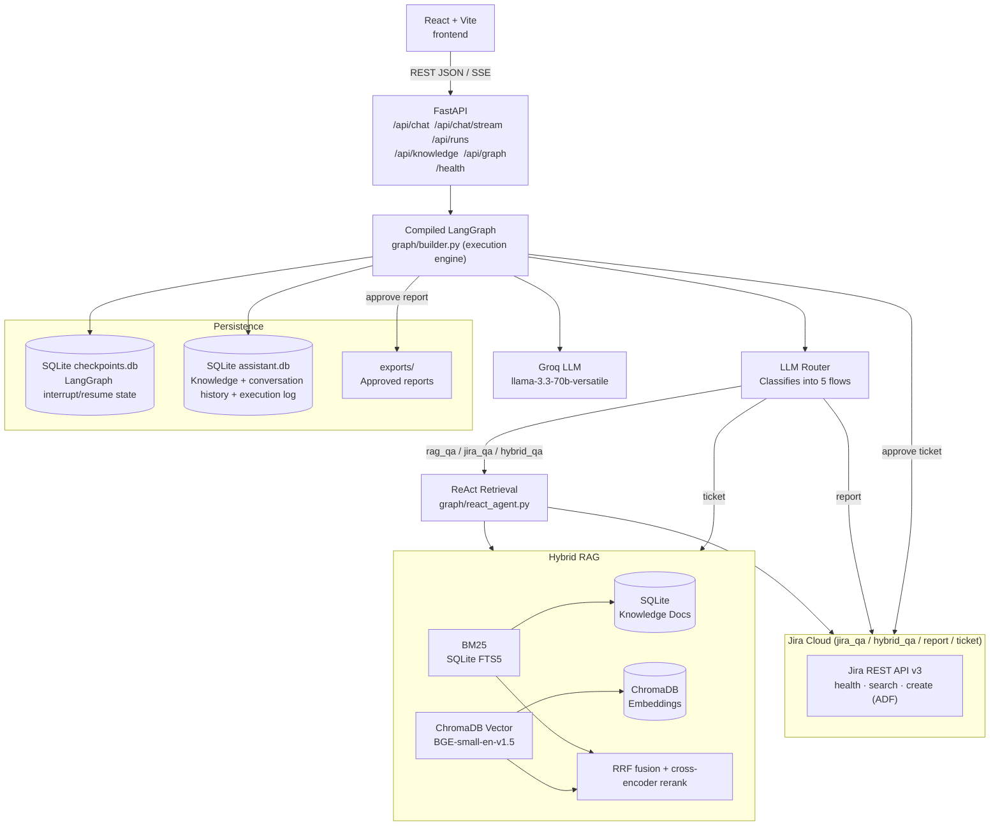

# Architecture

## Component responsibilities

| Component | File(s) | Role |
|-----------|---------|------|
| **React UI** | `frontend/src/main.jsx` | Chat, run summary panel, execution trace, approval, graph view |
| **FastAPI** | `app/main.py` | HTTP routes, SSE stream, CORS, startup (checkpointer setup, auto-ingest, git poller) |
| **Workflow (glue)** | `app/workflow.py` | Builds initial `GraphState`, invokes/resumes the compiled graph, shapes result into HTTP response models. No node logic. |
| **LangGraph builder** | `app/graph/builder.py` | Authoritative node/edge topology **and the live execution engine** — `graph.invoke()`/`.astream()` run every request |
| **State bridge** | `app/graph/bridge.py` | Converts LangGraph's dict `GraphState` ↔ pydantic `RunState` so existing agent/logging functions run unmodified |
| **ReAct retrieval** | `app/graph/react_agent.py` | LLM picks which retrieval tool(s) to call for rag_qa/jira_qa/hybrid_qa; deterministic fallback when Groq is off |
| **Router agent** | `app/agents/router.py` | LLM-based flow classification with heuristic fallback |
| **Ticket agent** | `app/agents/ticket.py` | Requirement enhancement, contradiction detection against BRD, structured ticket generation |
| **Report agents** | `app/agents/report.py` | plan\_report → write\_report → review\_report |
| **Q&A agents** | `app/agents/qa.py` | answer\_from\_rag, answer\_from\_jira, answer\_hybrid, expand\_query, nl\_to\_jql |
| **Hybrid RAG** | `app/retrievers/hybrid.py`, `app/tools/retrieval.py` | BM25 + vector → RRF fusion → cross-encoder rerank; plain + `@tool`-wrapped variants |
| **Jira tool** | `app/tools/jira.py` | health, search, create ticket (ADF format), project validation; plain + `@tool`-wrapped variants |
| **LLM service** | `app/services/llm.py` | invoke\_llm / invoke\_json, ChatGroq wrapper, JSON sanitizer |
| **Conversational memory** | `app/memory.py` | Per-`session_id` turn history in SQLite; formatted and injected into Q&A prompts |
| **SQLite** | `app/database.py` | Runs, knowledge documents (+ FTS5 index), execution log |
| **Logger** | `app/logging/logger.py` | track\_node context manager, append\_event, log\_llm\_before/after |
