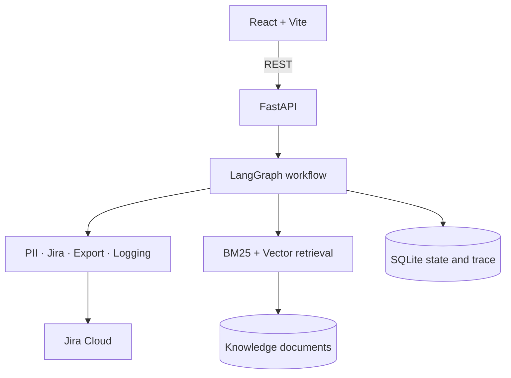

# Architecture diagram

```mermaid
flowchart TB
Client[React + Vite] -->|REST| API[FastAPI]
API --> Workflow[LangGraph workflow]
Workflow --> Tools[PII · Jira · Export · Logging]
Workflow --> Retrieval[BM25 + Vector retrieval]
Retrieval --> Knowledge[(Knowledge documents)]
Workflow --> Store[(SQLite state and trace)]
Tools --> Jira[Jira Cloud]
```
