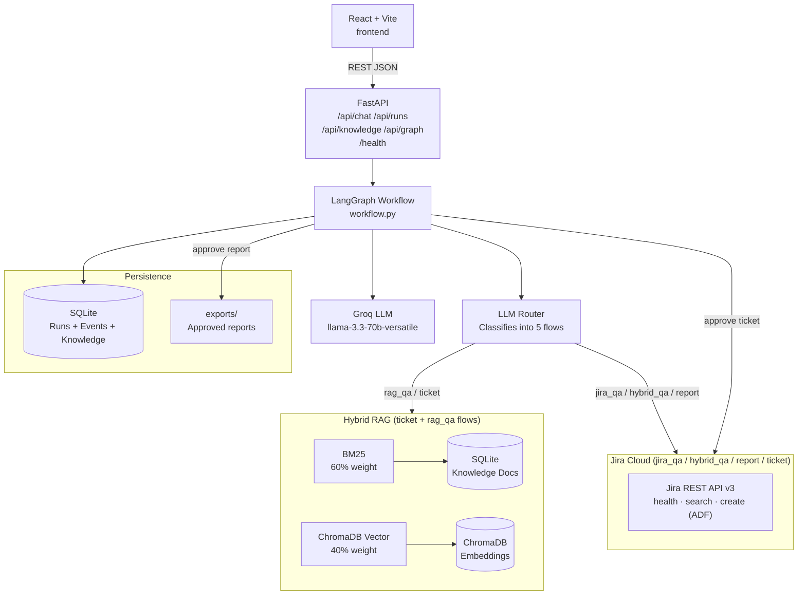

# Architecture

## Component responsibilities

| Component | File(s) | Role |
|-----------|---------|------|
| **React UI** | `frontend/src/main.jsx` | Chat, run summary panel, execution trace, approval, graph view |
| **FastAPI** | `app/main.py` | HTTP routes, SSE, CORS |
| **Workflow** | `app/workflow.py` | Execution engine for all 5 flows |
| **LangGraph builder** | `app/graph/builder.py` | Authoritative node/edge topology (Mermaid source) |
| **Router agent** | `app/agents/router.py` | LLM-based flow classification with heuristic fallback |
| **Ticket agent** | `app/agents/ticket.py` | Requirement enhancement + structured ticket generation |
| **Report agents** | `app/agents/report.py` | plan\_report → write\_report → review\_report |
| **Q&A agents** | `app/agents/qa.py` | answer\_from\_rag, answer\_from\_jira, answer\_hybrid, nl\_to\_jql |
| **Hybrid RAG** | `app/tools/retrieval.py` | Score fusion (BM25 + vector), returns both scores for observability |
| **Jira tool** | `app/tools/jira.py` | health, search, create ticket (ADF format), project validation |
| **LLM service** | `app/services/llm.py` | invoke\_llm / invoke\_json, ChatGroq wrapper, JSON sanitizer |
| **SQLite** | `app/database.py` | Runs, knowledge documents, execution log |
| **Logger** | `app/logging/logger.py` | track\_node context manager, append\_event, log\_llm\_before/after |
