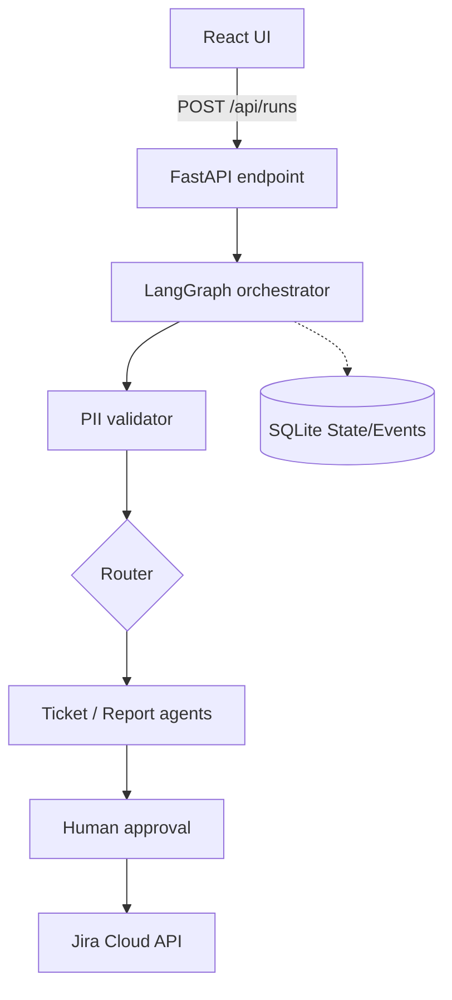

# High Level Design

The React client calls FastAPI to create a thread-bound workflow run. The orchestration layer validates PII, routes to ticket/report. For tickets, it retrieves relevant knowledge using hybrid lexical retrieval. For reports, it retrieves Jira metrics (defects, blockers, project health). It generates a structured draft, and stops at human approval. Only approved tickets cross the Jira tool boundary. SQLite persists runs, timeline events (inside the run payload), and knowledge documents.

