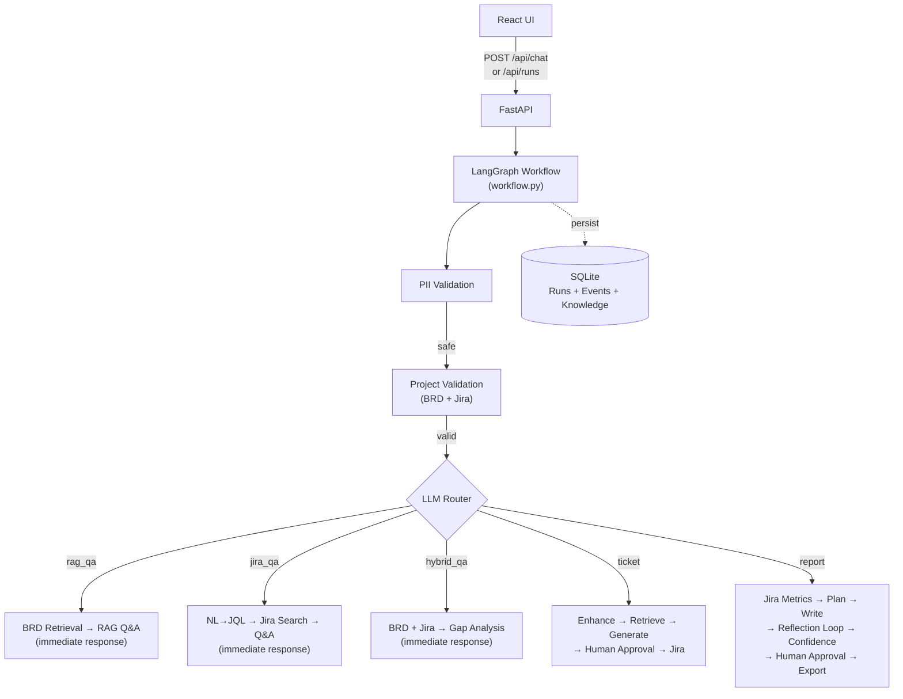

# High Level Design

## Overview

React client calls FastAPI to start a thread-bound workflow run. The orchestration layer validates PII, validates the project key, then routes to one of five agent flows.

- **Q&A flows** (`rag_qa`, `jira_qa`, `hybrid_qa`): retrieve context → answer → return immediately. No approval.
- **Ticket flow**: retrieve BRD context → generate draft → human approval → create Jira issue.
- **Report flow**: fetch Jira metrics → plan → write → review (reflection loop) → confidence check → human approval → export.

## Key design decisions

**Human-in-the-loop**: Ticket and report flows pause at `human_approval`. The run persists in SQLite with `status=awaiting_approval`. A subsequent `POST /api/runs/{id}/approve` resumes execution. This enables async review (user can close browser and come back).

**Reflection loop**: The report writer–reviewer loop runs up to 2 revisions before `confidence_check` gates to approval. This improves draft quality without requiring a human reviewer on every revision.

**Hybrid RAG**: BRD documents are scored with 60% BM25 (keyword) + 40% vector (semantic) fusion. Both component scores are preserved on the run for observability. Production path: swap vector proxy for managed embedding store + reranking.

**Demo mode**: Without API keys, the system uses template responses and a mock Jira key. All UI flows work identically. This lets developers evaluate the system without credentials.

**Observability**: Every LLM call, retrieval, tool call, and decision emits a `TimelineEvent` with node name, kind, message, and detail (including per-step token counts). The Run Summary panel in the UI renders these as a human-readable execution trace.

## Operating modes

| Mode | Keys present | LLM | Jira |
|------|-------------|-----|------|
| `demo` | None | Template fallback | Mock (`DEMO-101`) |
| `groq` | `GROQ_API_KEY` | Real LLM | Mock |
| `live` | Groq + Jira keys | Real LLM | Real Jira REST |
