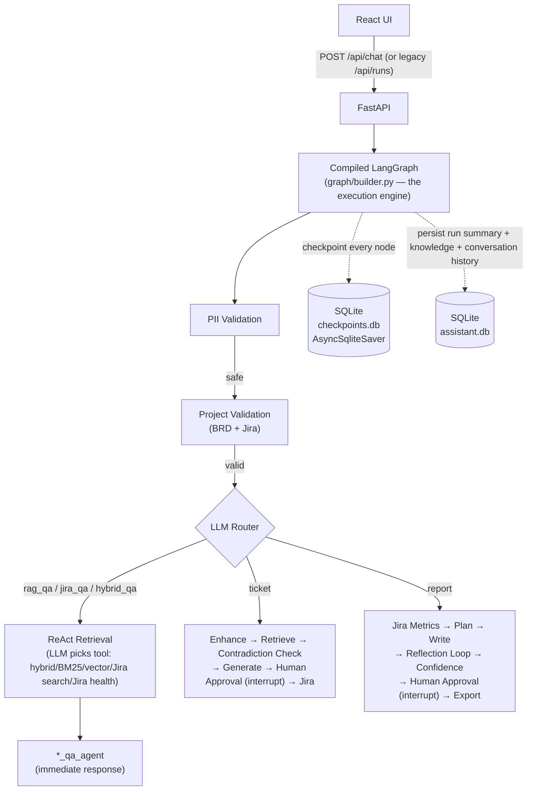

# High Level Design

## Overview

React client calls FastAPI to start a thread-bound workflow run. The orchestration layer validates PII, validates the project key, then routes to one of five agent flows.

- **Q&A flows** (`rag_qa`, `jira_qa`, `hybrid_qa`): retrieve context → answer → return immediately. No approval.
- **Ticket flow**: retrieve BRD context → generate draft → human approval → create Jira issue.
- **Report flow**: fetch Jira metrics → plan → write → review (reflection loop) → confidence check → human approval → export.

## Key design decisions

**Human-in-the-loop via LangGraph `interrupt()`**: Ticket and report flows pause at `human_approval` using a real graph interrupt, checkpointed to `checkpoints.db` (`AsyncSqliteSaver`, keyed by `thread_id=run_id`). A subsequent `POST /api/runs/{id}/approve` resumes with `Command(resume=...)`. This enables async review (user can close browser and come back) and survives server restarts.

**Reflection loop**: The report writer–reviewer loop runs up to 2 revisions before `confidence_check` gates to approval (quality threshold 0.90). This improves draft quality without requiring a human reviewer on every revision.

**Hybrid RAG + ReAct tool selection**: BRD documents are scored via BM25 (SQLite FTS5) + vector (ChromaDB, BGE-small embeddings) fused with Reciprocal Rank Fusion, then reordered by a cross-encoder reranker. A ReAct node lets the LLM choose which retrieval tool(s) to call per question rather than the graph hardcoding one path per flow. See `docs/RAG.md`.

**Demo mode**: Without a Groq key, LLM-dependent nodes raise and are caught as a "LLM unavailable" response; without Jira keys, Jira tools return `mode=unavailable`/mock data. This lets developers evaluate retrieval and routing without credentials.

**Conversational memory**: Each chat turn is persisted per `session_id` in SQLite (`memory.py`, last 20 turns). The last 6 turns are formatted and injected into the Q&A prompts so follow-up questions ("what about the second one?") resolve correctly.

**Observability**: Every LLM call, retrieval, tool call, and decision emits a `TimelineEvent` with node name, kind, message, and detail (including per-step token counts). The Run Summary panel in the UI renders these as a human-readable execution trace.

## Operating modes

| Mode | Keys present | LLM | Jira |
|------|-------------|-----|------|
| `demo` | None | Template fallback | Mock (`DEMO-101`) |
| `groq` | `GROQ_API_KEY` | Real LLM | Mock |
| `live` | Groq + Jira keys | Real LLM | Real Jira REST |
