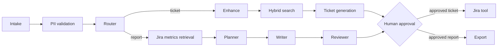

# LangGraph diagram

```mermaid
flowchart LR
I[Intake] --> P[PII validation] --> R[Router]
R -->|ticket| E[Enhance] --> S[Hybrid search] --> T[Ticket generation]
R -->|report| S2[Jira metrics retrieval] --> PL[Planner] --> W[Writer] --> V[Reviewer]
T --> H{Human approval}
V --> H
H -->|approved ticket| J[Jira tool]
H -->|approved report| X[Export]
```

`app/graph.py` holds the LangGraph topology. The HTTP runner persists its approval checkpoint in SQLite, allowing approval to be performed in a later request.
