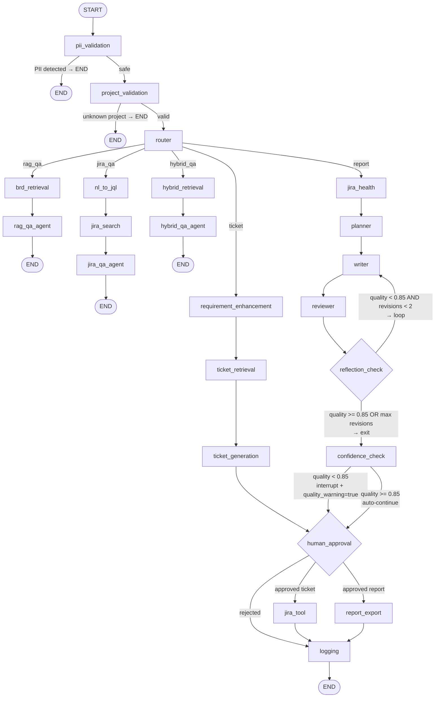
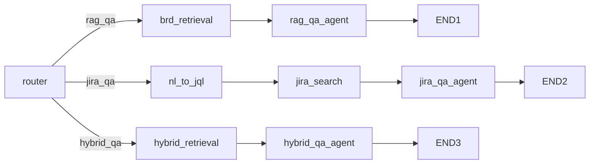

# LangGraph topology

`app/graph/builder.py` holds the authoritative node and edge definitions. `workflow.py` is the execution engine — it mirrors every node here and calls the actual agent/tool functions.

`GET /api/graph` returns this topology as Mermaid source for the UI graph view.

## Full graph

## Decision points

| Node | Condition | Next |
|------|-----------|------|
| `pii_validation` | PII detected | END |
| `pii_validation` | Safe | `project_validation` |
| `project_validation` | Unknown project key | END |
| `project_validation` | Valid key | `router` |
| `router` | `flow="rag_qa"` | `brd_retrieval` |
| `router` | `flow="jira_qa"` | `nl_to_jql` |
| `router` | `flow="hybrid_qa"` | `hybrid_retrieval` |
| `router` | `flow="ticket"` | `requirement_enhancement` |
| `router` | `flow="report"` | `jira_health` |
| `reflection_check` | `quality_score < 0.85` AND `revision < 2` | `writer` (loop) |
| `reflection_check` | `quality_score >= 0.85` OR `revision >= 2` | `confidence_check` |
| `confidence_check` | `quality_score < 0.85` | `human_approval` with `quality_warning=true` |
| `confidence_check` | `quality_score >= 0.85` | `human_approval` with `quality_warning=false` |
| `human_approval` | Approved ticket | `jira_tool` |
| `human_approval` | Approved report | `report_export` |
| `human_approval` | Rejected | `logging` |

## Q&A flows (no approval)

All three Q&A flows return immediately — no human approval step.

- **rag_qa**: BM25 + vector retrieval over BRD knowledge base → LLM answer with citations
- **jira_qa**: NL→JQL translation → Jira REST search → LLM synthesis over Jira issues
- **hybrid_qa**: Both sources in parallel → LLM gap analysis (requirements vs coverage)

## Reflection loop (report flow)

- Max revisions: 2
- Quality threshold: 0.85
- `reviewer` returns `quality_score` (0–1), `review_notes[]`, revised `markdown`
- `reflection_check` emits a timeline event on BOTH loop and exit paths
- `confidence_check` sets `quality_warning` in state; UI surfaces this as a warning badge

## Execution model

`workflow.py` does not call `graph.invoke()`. It runs each flow as a direct Python function call sequence. The `graph/builder.py` topology is compiled for:
1. `GET /api/graph` — returns Mermaid source for UI
2. LangSmith — `@traceable` decorators inject `thread_id`, `run_id`, `flow`, `project_key` into trace metadata
3. Documentation source of truth for node/edge contracts
