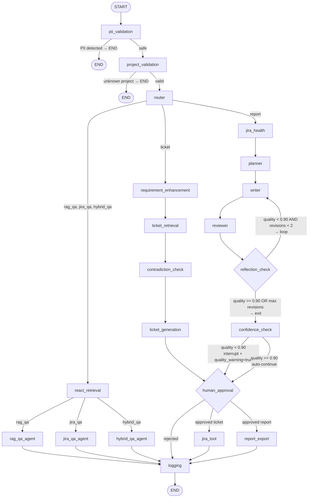
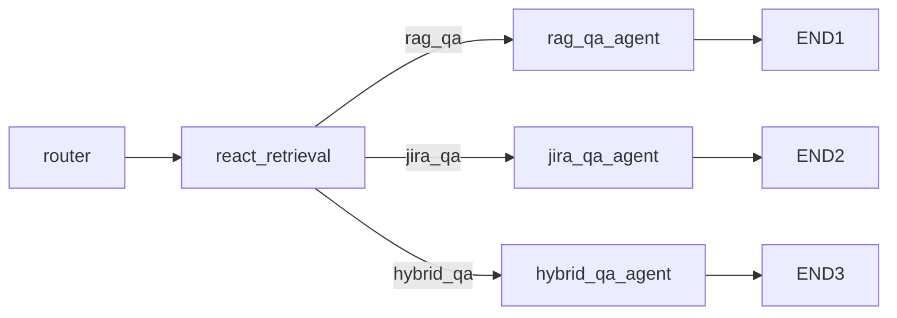
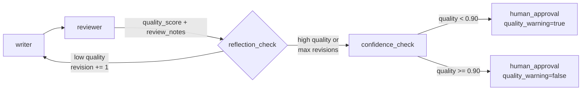

# LangGraph topology

`app/graph/builder.py` holds the authoritative node and edge definitions **and is the live execution engine** — `graph.invoke()` / `.ainvoke()` / `.astream()` drive every flow. `app/workflow.py` is thin entry-point glue: it builds the initial `GraphState` dict, calls the compiled graph, and reshapes the final state into HTTP response models. It does not re-implement any node logic.

`app/graph/bridge.py` converts between the plain-dict `GraphState` LangGraph checkpoints and the pydantic `RunState` object the pre-existing `agents/*.py` / `logging/logger.py` functions expect (attribute access). Every node rehydrates a `RunState` via `to_run_state()`, mutates it exactly as before, then dumps it back with `from_run_state()`.

`GET /api/graph` calls `app.state.graph.get_graph().draw_mermaid()` directly on the compiled graph — the Mermaid diagram returned to the UI is generated from the same object that executes requests, so it cannot drift from reality.

## Full graph

One node, `react_retrieval`, now serves all three Q&A flows — the LLM (bound to 5 retrieval tools) decides what to call, rather than the graph hardcoding `brd_retrieval` for `rag_qa` and `nl_to_jql → jira_search` for `jira_qa`. See `docs/RAG.md` for the tool-selection logic.

The ticket flow also gained a `contradiction_check` node (`agents/ticket.detect_contradictions`) between retrieval and generation — it compares the enhanced requirement against retrieved BRD sections and produces a `grounded_requirement`, flagging contradictions/ambiguities that get attached to the ticket draft (`ticket["_contradictions"]`, `ticket["_ambiguities"]`).

## Decision points

| Node | Condition | Next |
|------|-----------|------|
| `pii_validation` | PII detected | END |
| `pii_validation` | Safe | `project_validation` |
| `project_validation` | Unknown project key | END |
| `project_validation` | Valid key (BRD or Jira match) | `router` |
| `router` | `flow="rag_qa" \| "jira_qa" \| "hybrid_qa"` | `react_retrieval` |
| `router` | `flow="ticket"` | `requirement_enhancement` |
| `router` | `flow="report"` | `jira_health` |
| `react_retrieval` | matching `*_qa_agent` node for `state["flow"]` | — |
| `reflection_check` | `quality_score < 0.90` AND `revision_count < 2` | `writer` (loop) |
| `reflection_check` | `quality_score >= 0.90` OR `revision_count >= 2` | `confidence_check` |
| `confidence_check` | `quality_score < 0.90` | `human_approval` with `quality_warning=true` |
| `confidence_check` | `quality_score >= 0.90` | `human_approval` with `quality_warning=false` |
| `human_approval` | Approved ticket | `jira_tool` |
| `human_approval` | Approved report | `report_export` |
| `human_approval` | Rejected | `logging` |

## Q&A flows (no approval)

All three Q&A flows return immediately — no human approval step.

- **rag_qa**: ReAct-selected BRD retrieval (usually `hybrid_search_tool_react`) + query expansion → LLM answer with citations and confidence
- **jira_qa**: ReAct-selected `jira_search_react` (targeted JQL) or `jira_project_health_react` (scoped metrics) → LLM synthesis over Jira issues
- **hybrid_qa**: ReAct-selected BRD + Jira tools, plus a forced full-backlog fetch for coverage accuracy → LLM gap analysis (requirements vs coverage), with corrected coverage counts computed in code (`answer_hybrid`) rather than trusted from the LLM

## Human-in-the-loop mechanics

`human_approval` calls LangGraph's `interrupt()` — this is a real graph suspension, not a manual "save state and wait for a second HTTP call" pattern. The checkpointer (`AsyncSqliteSaver` writing to `checkpoints.db` in production, `MemorySaver` fallback) persists the full graph state at the interrupt boundary. `POST /api/runs/{id}/approve` resumes with `graph.ainvoke(Command(resume={"approved": ..., "feedback": ...}), config)`, and LangGraph replays from the interrupt point — surviving process restarts as long as the checkpoint DB is on disk.

## Reflection loop (report flow)

- Max revisions: 2 (`_MAX_REVISIONS`)
- Quality threshold: 0.90 (`_QUALITY_THRESHOLD`, `builder.py`)
- `reviewer` returns `quality_score` (0–1), `review_notes[]`, revised `markdown`
- `reflection_check` emits a timeline event on both loop and exit paths
- `confidence_check` sets `quality_warning` in state; UI surfaces this as a warning badge

## Execution model

`workflow.py` builds the initial `GraphState`, calls `graph.ainvoke()` / `graph.astream(..., stream_mode="updates")`, and shapes the returned state into `ChatResponse`. It performs no node logic itself. `chat_stream()` yields one `{"type": "step", "node": ..., "message": ...}` event per completed node (mapped to a user-facing label via `NODE_LABELS`) for a live progress UI, then a final `{"type": "done", "response": ...}`.

Checkpointing (`thread_id` = `run_id`) gives every flow, not just ticket/report, resumability and full state history via `graph.aget_state()` — used by the legacy `GET /api/runs/{run_id}` endpoint.
