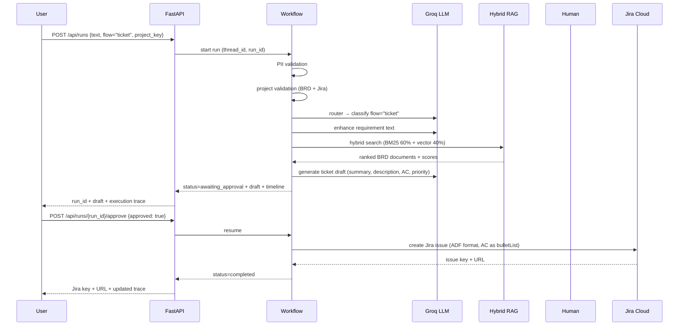
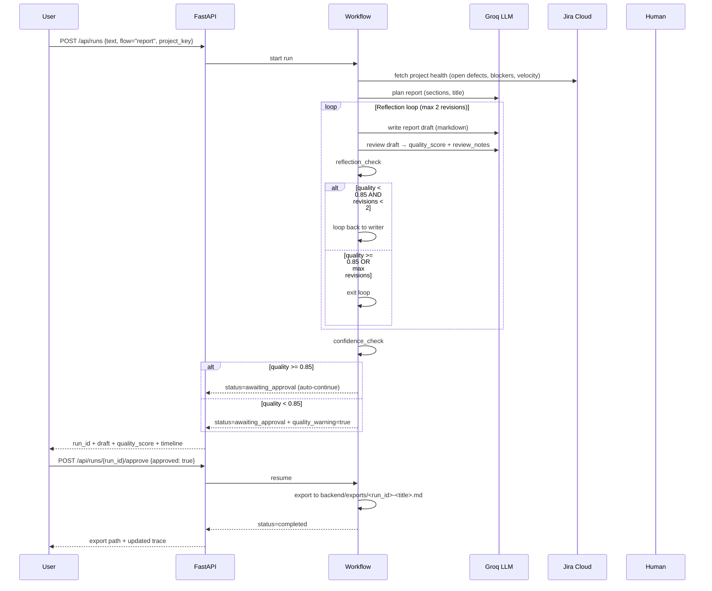
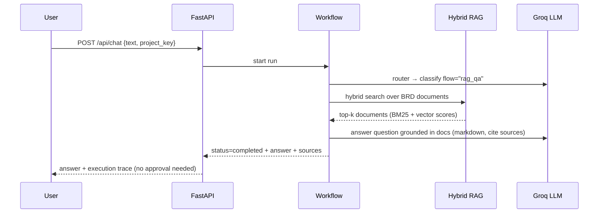
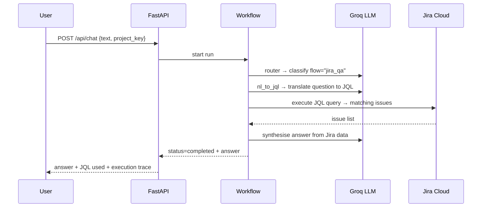

# Workflow sequences

## Ticket flow

```mermaid
sequenceDiagram
    participant U as User
    participant API as FastAPI
    participant WF as Workflow
    participant LLM as Groq LLM
    participant RAG as Hybrid RAG
    participant H as Human
    participant J as Jira Cloud

    U->>API: POST /api/runs {text, flow="ticket", project_key}
    API->>WF: start run (thread_id, run_id)
    WF->>WF: PII validation
    WF->>WF: project validation (BRD + Jira)
    WF->>LLM: router → classify flow="ticket"
    WF->>LLM: enhance requirement text
    WF->>RAG: hybrid search (BM25 60% + vector 40%)
    RAG-->>WF: ranked BRD documents + scores
    WF->>LLM: generate ticket draft (summary, description, AC, priority)
    WF-->>API: status=awaiting_approval + draft + timeline
    API-->>U: run_id + draft + execution trace

    U->>API: POST /api/runs/{run_id}/approve {approved: true}
    API->>WF: resume
    WF->>J: create Jira issue (ADF format, AC as bulletList)
    J-->>WF: issue key + URL
    WF-->>API: status=completed
    API-->>U: Jira key + URL + updated trace
```

## Report flow (with reflection loop)

```mermaid
sequenceDiagram
    participant U as User
    participant API as FastAPI
    participant WF as Workflow
    participant LLM as Groq LLM
    participant J as Jira Cloud
    participant H as Human

    U->>API: POST /api/runs {text, flow="report", project_key}
    API->>WF: start run
    WF->>J: fetch project health (open defects, blockers, velocity)
    WF->>LLM: plan report (sections, title)
    
    loop Reflection loop (max 2 revisions)
        WF->>LLM: write report draft (markdown)
        WF->>LLM: review draft → quality_score + review_notes
        WF->>WF: reflection_check
        alt quality < 0.85 AND revisions < 2
            WF->>WF: loop back to writer
        else quality >= 0.85 OR max revisions
            WF->>WF: exit loop
        end
    end

    WF->>WF: confidence_check
    alt quality >= 0.85
        WF-->>API: status=awaiting_approval (auto-continue)
    else quality < 0.85
        WF-->>API: status=awaiting_approval + quality_warning=true
    end
    API-->>U: run_id + draft + quality_score + timeline

    U->>API: POST /api/runs/{run_id}/approve {approved: true}
    API->>WF: resume
    WF->>WF: export to backend/exports/<run_id>-<title>.md
    WF-->>API: status=completed
    API-->>U: export path + updated trace
```

## RAG Q&A flow (immediate)

```mermaid
sequenceDiagram
    participant U as User
    participant API as FastAPI
    participant WF as Workflow
    participant RAG as Hybrid RAG
    participant LLM as Groq LLM

    U->>API: POST /api/chat {text, project_key}
    API->>WF: start run
    WF->>LLM: router → classify flow="rag_qa"
    WF->>RAG: hybrid search over BRD documents
    RAG-->>WF: top-k documents (BM25 + vector scores)
    WF->>LLM: answer question grounded in docs (markdown, cite sources)
    WF-->>API: status=completed + answer + sources
    API-->>U: answer + execution trace (no approval needed)
```

## Jira Q&A flow (immediate)

```mermaid
sequenceDiagram
    participant U as User
    participant API as FastAPI
    participant WF as Workflow
    participant LLM as Groq LLM
    participant J as Jira Cloud

    U->>API: POST /api/chat {text, project_key}
    API->>WF: start run
    WF->>LLM: router → classify flow="jira_qa"
    WF->>LLM: nl_to_jql → translate question to JQL
    WF->>J: execute JQL query → matching issues
    J-->>WF: issue list
    WF->>LLM: synthesise answer from Jira data
    WF-->>API: status=completed + answer
    API-->>U: answer + JQL used + execution trace
```
