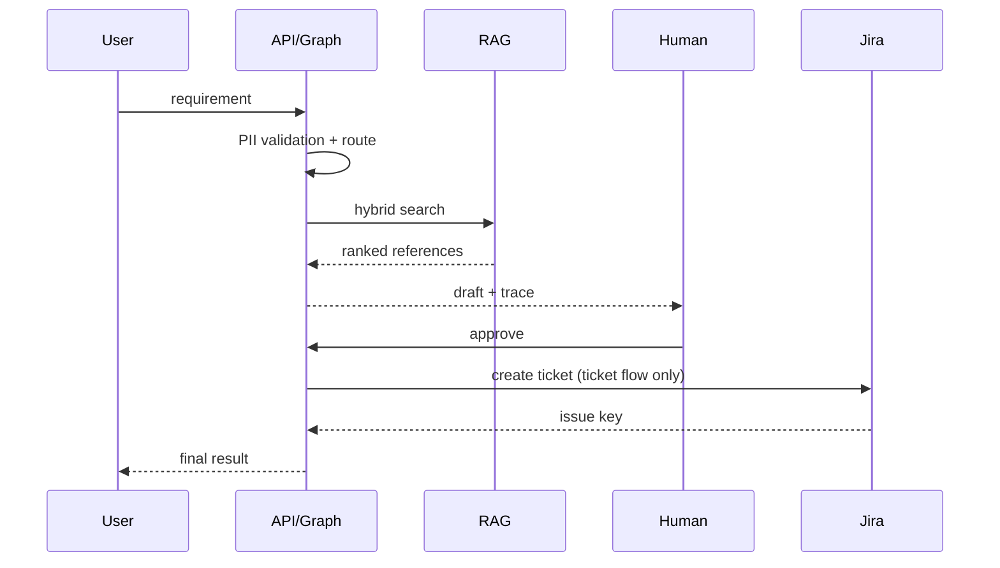

# Workflow sequence

```mermaid
sequenceDiagram
participant U as User
participant A as API/Graph
participant R as RAG
participant H as Human
participant J as Jira
U->>A: requirement
A->>A: PII validation + route
A->>R: hybrid search
R-->>A: ranked references
A-->>H: draft + trace
H->>A: approve
A->>J: create ticket (ticket flow only)
J-->>A: issue key
A-->>U: final result
```
