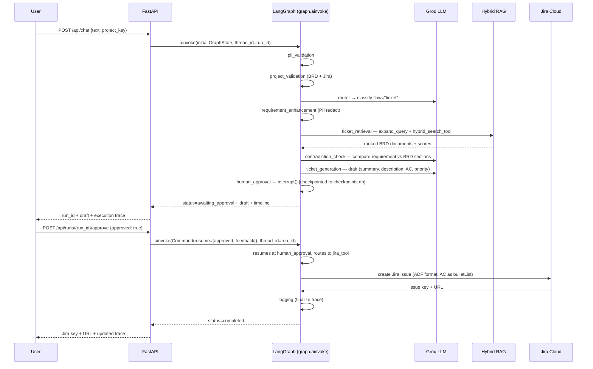
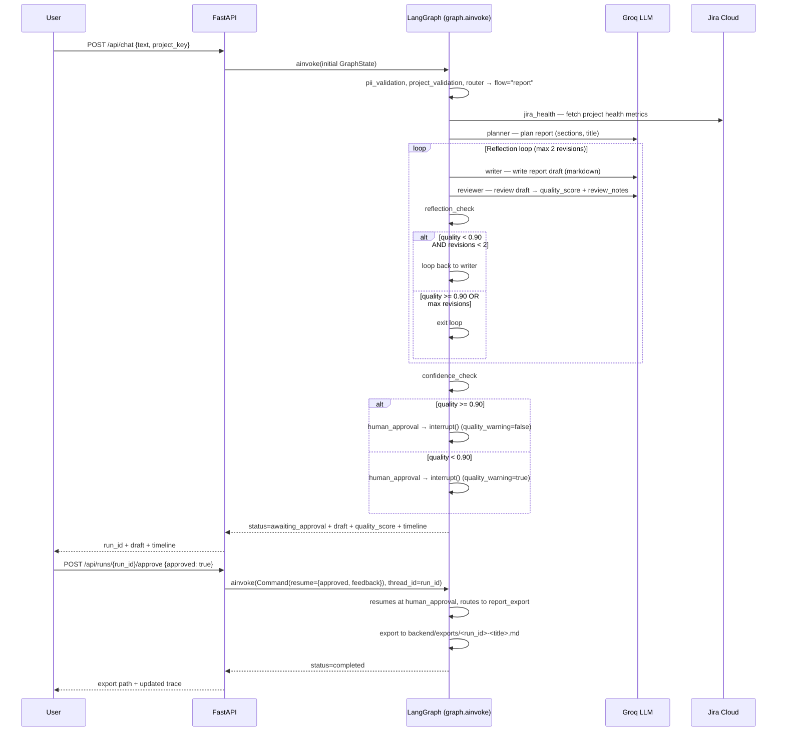
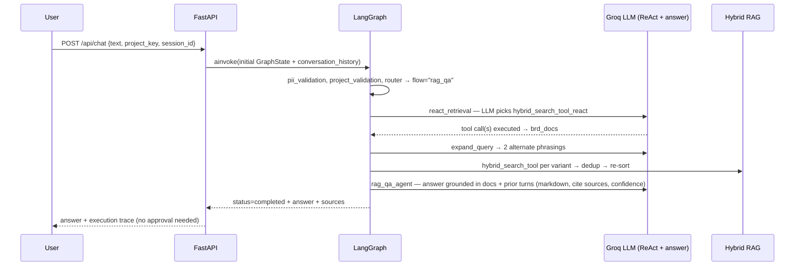
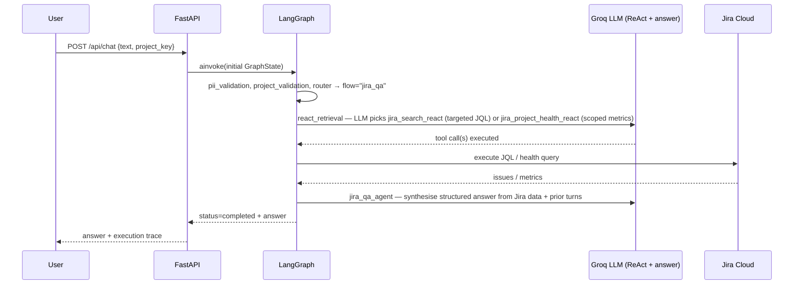

# Workflow sequences

All flows now enter through the compiled LangGraph (`graph/builder.py`) via `workflow.chat()` / `workflow.chat_stream()`, which call `graph.ainvoke()` / `graph.astream()`. The legacy `POST /api/runs` path (`workflow.start()`) still works for backward compatibility but skips project validation and forces the flow explicitly.

## Ticket flow



## Report flow (with reflection loop)



## RAG Q&A flow (immediate)



## Jira Q&A flow (immediate)



## Hybrid Q&A flow (immediate, with gap-cycling follow-up)

```mermaid
sequenceDiagram
    participant U as User
    participant API as FastAPI
    participant G as LangGraph
    participant LLM as Groq LLM

    U->>API: POST /api/chat {text: "are all requirements covered?"}
    API->>G: ainvoke(initial GraphState)
    G->>G: pii_validation, project_validation, router → flow="hybrid_qa"
    G->>LLM: react_retrieval — BRD + Jira tools, plus forced full-backlog fetch
    G->>LLM: expand_query on BRD half
    G->>LLM: hybrid_qa_agent — gap analysis; coverage counts recomputed in code from gaps[]
    G-->>API: status=completed + answer + pending_action{gaps, topic} if gaps found
    API-->>U: answer + "generate tickets for N missing requirements?" prompt

    U->>API: POST /api/chat {text: "yes", pending_action: {...}}
    Note over API: _build_chat_state rewrites text into a ticket-flow request for the first gap
    API->>G: ainvoke(initial GraphState, flow=ticket)
    Note over G: proceeds as Ticket flow; remaining gaps carried as pending_gaps for the next turn
```
